# ThinkNote AI - Main Project Flowchart

## Role-Specific Flowcharts

- [Teacher Flowchart](teacher-flowchart.md)
- [Student Flowchart](student-flowchart.md)
- [Administrator Flowchart](admin-flowchart.md)

```mermaid
%%{init: {
    "flowchart": {
        "curve": "stepAfter",
        "nodeSpacing": 38,
        "rankSpacing": 48
    }
}}%%
flowchart TB
    START([Start]) --> OPEN[/Open ThinkNote AI/]
    OPEN --> REGISTERED{Registered or not?}

    REGISTERED -- Yes --> LOGIN[/Enter email and password/]
    LOGIN --> CHECK_LOGIN{Email and password correct?}
    CHECK_LOGIN -- No --> LOGIN_ERROR[/Email and password error reported/]
    LOGIN_ERROR --> LOGIN
    CHECK_LOGIN -- Yes --> LOGIN_SUCCESS[Login successful]
    LOGIN_SUCCESS --> ROLE{Determine user role}

    REGISTERED -- No --> IDENTITY[/Select identity/]
    IDENTITY --> TEACHER_CHOICE[Teacher]
    IDENTITY --> STUDENT_CHOICE[Student]
    TEACHER_CHOICE --> TEACHER_INFO[/Enter teacher information/]
    STUDENT_CHOICE --> STUDENT_INFO[/Enter student information/]
    TEACHER_INFO --> EMAIL[/Enter email/]
    STUDENT_INFO --> EMAIL
    EMAIL --> CHECK_EMAIL{Email format correct?}
    CHECK_EMAIL -- No --> EMAIL_ERROR[/Show email format error/]
    EMAIL_ERROR --> EMAIL
    CHECK_EMAIL -- Yes --> SEND_CODE[Send verification code]
    SEND_CODE --> CODE[/Enter verification code/]
    CODE --> VERIFY{Verify the match?}
    VERIFY -- No --> CODE
    VERIFY -- Yes --> REGISTER_SUCCESS[Register successfully]
    REGISTER_SUCCESS --> LOGIN

    ROLE -- Teacher --> TDASH[Teacher dashboard]
    TDASH --> SOURCE{Video source?}
    SOURCE -- Local video --> UPLOAD[/Upload video and reference summary/]
    SOURCE -- YouTube URL --> YOUTUBE[/Enter YouTube URL and reference summary/]
    UPLOAD --> SAVE[Save video record]
    YOUTUBE --> DOWNLOAD[Download YouTube video]
    DOWNLOAD --> SAVE
    SAVE --> QUEUE[Create processing job]

    QUEUE --> CHECK_SOURCE{Subtitles available?}
    CHECK_SOURCE -- Yes --> PARSE[Parse subtitles]
    CHECK_SOURCE -- No --> AUDIO[Extract audio]
    AUDIO --> WHISPER[Transcribe with Whisper]
    PARSE --> TRANSCRIPT[Store transcript]
    WHISPER --> TRANSCRIPT
    TRANSCRIPT --> FRAMES[Extract keyframes]
    FRAMES --> VISION[Analyze slides, text, and equations]
    VISION --> FUSION[Combine speech and visual evidence]
    FUSION --> NLP[Clean and reduce repetition]
    NLP --> SUMMARY[Generate lecture and slide summaries]
    SUMMARY --> EVALUATE[Calculate ROUGE scores]
    EVALUATE --> SUCCESS{Processing successful?}
    SUCCESS -- No --> FAILED[Set status to failed]
    FAILED --> FAIL_OUTPUT[/Show processing error/]
    FAIL_OUTPUT --> END([End])
    SUCCESS -- Yes --> COMPLETE[Save results and mark completed]
    COMPLETE --> PUBLISH{Publish or assign?}
    PUBLISH -- No --> DRAFT[Keep video in teacher library]
    PUBLISH -- Yes --> ASSIGN[Publish and assign to students]
    DRAFT --> END
    ASSIGN --> END

    ROLE -- Student --> SDASH[Student dashboard]
    SDASH --> AVAILABLE{Assigned video available?}
    AVAILABLE -- No --> EMPTY[/Show no available lecture/]
    EMPTY --> END
    AVAILABLE -- Yes --> SELECT[/Select lecture/]
    SELECT --> WATCH[Watch lecture video]
    WATCH --> VIEW[/View summary, transcript, slides, and results/]
    VIEW --> CHAT{Ask a question?}
    CHAT -- Yes --> QUESTION[/Enter question/]
    QUESTION --> ANSWER[Generate answer from lecture content]
    ANSWER --> VIEW
    CHAT -- No --> END

    classDef terminal fill:#d5f5e3,stroke:#1e8449,stroke-width:2px,color:#17202a;
    classDef process fill:#d6eaf8,stroke:#2471a3,stroke-width:1.5px,color:#17202a;
    classDef decision fill:#fcf3cf,stroke:#b7950b,stroke-width:1.5px,color:#17202a;
    classDef io fill:#f5eef8,stroke:#7d3c98,stroke-width:1.5px,color:#17202a;
    classDef failure fill:#fadbd8,stroke:#c0392b,stroke-width:1.5px,color:#17202a;

    class START,END terminal;
    class LOGIN_SUCCESS,TEACHER_CHOICE,STUDENT_CHOICE,SEND_CODE,REGISTER_SUCCESS,TDASH,SAVE,DOWNLOAD,QUEUE,PARSE,AUDIO,WHISPER,TRANSCRIPT,FRAMES,VISION,FUSION,NLP,SUMMARY,EVALUATE,COMPLETE,DRAFT,ASSIGN,SDASH,WATCH,ANSWER process;
    class REGISTERED,CHECK_LOGIN,ROLE,CHECK_EMAIL,VERIFY,SOURCE,CHECK_SOURCE,SUCCESS,PUBLISH,AVAILABLE,CHAT decision;
    class OPEN,LOGIN,LOGIN_ERROR,IDENTITY,TEACHER_INFO,STUDENT_INFO,EMAIL,EMAIL_ERROR,CODE,UPLOAD,YOUTUBE,FAIL_OUTPUT,EMPTY,SELECT,VIEW,QUESTION io;
    class FAILED failure;
```

## Programming Flowchart Standard

This flowchart follows standard programming flowchart symbols to show the step-by-step logic, data flow, and control structure of the ThinkNote AI system.

## Symbol Key

- **Oval / Terminator**: Start or end of the program flow.
- **Parallelogram**: User input or system output, such as login details, uploaded videos, displayed errors, or displayed results.
- **Rectangle**: Process step, such as account creation, saving records, transcription, summary generation, or evaluation.
- **Diamond**: Decision point that branches the flow, such as valid credentials, selected role, subtitle availability, or processing success.
- **Arrows / Flow Lines**: Direction of execution from one step to the next.
- **Circle / Connector**: Used only when a complex diagram needs same-page line connectors. This diagram does not require connectors because the flow is still readable without them.
