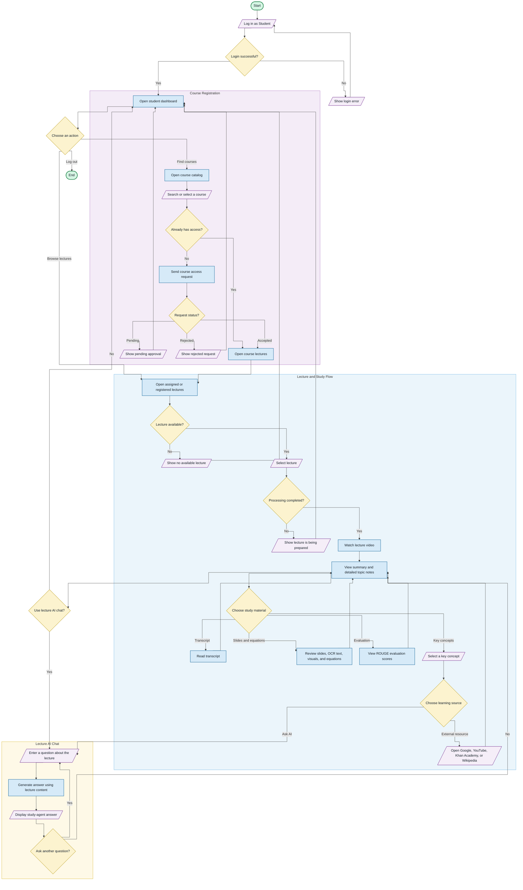

# ThinkNote AI — Student Flowchart

```mermaid
%%{init: {"flowchart": {"curve": "stepAfter", "nodeSpacing": 35, "rankSpacing": 45}}}%%
flowchart TB
    START([Start]) --> LOGIN[/Log in as Student/]
    LOGIN --> VALID{Login successful?}
    VALID -- No --> ERROR[/Show login error/]
    ERROR --> LOGIN
    VALID -- Yes --> DASH[Open student dashboard]
    DASH --> ACTION{Choose an action}

    subgraph COURSES["Course Registration"]
        direction TB
        CATALOG[Open course catalog]
        SEARCH[/Search or select a course/]
        ACCESS{Already has access?}
        OPEN_COURSE[Open course lectures]
        REQUEST[Send course access request]
        STATUS{Request status?}
        WAIT[/Show pending approval/]
        REJECTED[/Show rejected request/]

        CATALOG --> SEARCH
        SEARCH --> ACCESS
        ACCESS -- Yes --> OPEN_COURSE
        ACCESS -- No --> REQUEST
        REQUEST --> STATUS
        STATUS -- Pending --> WAIT
        STATUS -- Rejected --> REJECTED
        STATUS -- Accepted --> OPEN_COURSE
        WAIT --> DASH
        REJECTED --> DASH
    end

    subgraph STUDY["Lecture and Study Flow"]
        direction TB
        LECTURES[Open assigned or registered lectures]
        AVAILABLE{Lecture available?}
        EMPTY[/Show no available lecture/]
        SELECT[/Select lecture/]
        READY{Processing completed?}
        PREPARING[/Show lecture is being prepared/]
        WATCH[Watch lecture video]
        NOTES[View summary and detailed topic notes]
        MATERIAL{Choose study material}
        TRANSCRIPT[Read transcript]
        SLIDES[Review slides, OCR text, visuals, and equations]
        SCORES[View ROUGE evaluation scores]
        CONCEPTS[/Select a key concept/]
        SOURCE{Choose learning source}
        EXTERNAL[/Open Google, YouTube, Khan Academy, or Wikipedia/]

        LECTURES --> AVAILABLE
        AVAILABLE -- No --> EMPTY
        EMPTY --> DASH
        AVAILABLE -- Yes --> SELECT
        SELECT --> READY
        READY -- No --> PREPARING
        PREPARING --> DASH
        READY -- Yes --> WATCH
        WATCH --> NOTES
        NOTES --> MATERIAL
        MATERIAL -- Transcript --> TRANSCRIPT
        MATERIAL -- Slides and equations --> SLIDES
        MATERIAL -- Evaluation --> SCORES
        MATERIAL -- Key concepts --> CONCEPTS
        TRANSCRIPT --> NOTES
        SLIDES --> NOTES
        SCORES --> NOTES
        CONCEPTS --> SOURCE
        SOURCE -- External resource --> EXTERNAL
        EXTERNAL --> NOTES
    end

    subgraph CHATFLOW["Lecture AI Chat"]
        direction TB
        ASK[/Enter a question about the lecture/]
        GENERATE[Generate answer using lecture content]
        DISPLAY[/Display study-agent answer/]
        MORE{Ask another question?}

        ASK --> GENERATE
        GENERATE --> DISPLAY
        DISPLAY --> MORE
        MORE -- Yes --> ASK
        MORE -- No --> NOTES
    end

    ACTION -- Find courses --> CATALOG
    ACTION -- Browse lectures --> LECTURES
    ACTION -- Log out --> END([End])
    OPEN_COURSE --> LECTURES
    SOURCE -- Ask AI --> ASK
    NOTES --> CHAT{Use lecture AI chat?}
    CHAT -- Yes --> ASK
    CHAT -- No --> DASH

    classDef terminal fill:#d5f5e3,stroke:#1e8449,stroke-width:2px,color:#17202a;
    classDef process fill:#d6eaf8,stroke:#2471a3,stroke-width:1.5px,color:#17202a;
    classDef decision fill:#fcf3cf,stroke:#b7950b,stroke-width:1.5px,color:#17202a;
    classDef io fill:#f5eef8,stroke:#7d3c98,stroke-width:1.5px,color:#17202a;

    class START,END terminal;
    class DASH,CATALOG,OPEN_COURSE,REQUEST,LECTURES,WATCH,NOTES,TRANSCRIPT,SLIDES,SCORES,GENERATE process;
    class VALID,ACTION,ACCESS,STATUS,AVAILABLE,READY,MATERIAL,SOURCE,CHAT,MORE decision;
    class LOGIN,ERROR,SEARCH,WAIT,REJECTED,EMPTY,SELECT,PREPARING,CONCEPTS,EXTERNAL,ASK,DISPLAY io;

    style COURSES fill:#f4ecf7,stroke:#a569bd
    style STUDY fill:#ebf5fb,stroke:#5dade2
    style CHATFLOW fill:#fef9e7,stroke:#d4ac0d
```

## Symbol Key

- Oval: start or end.
- Rectangle: process or system action.
- Diamond: decision.
- Parallelogram: input or output.
- Arrow: flow direction.
