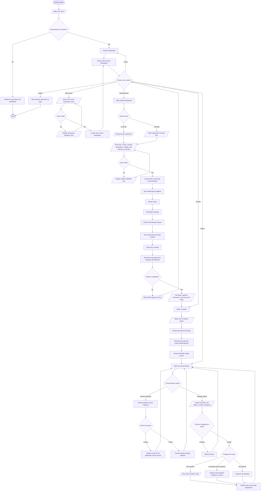
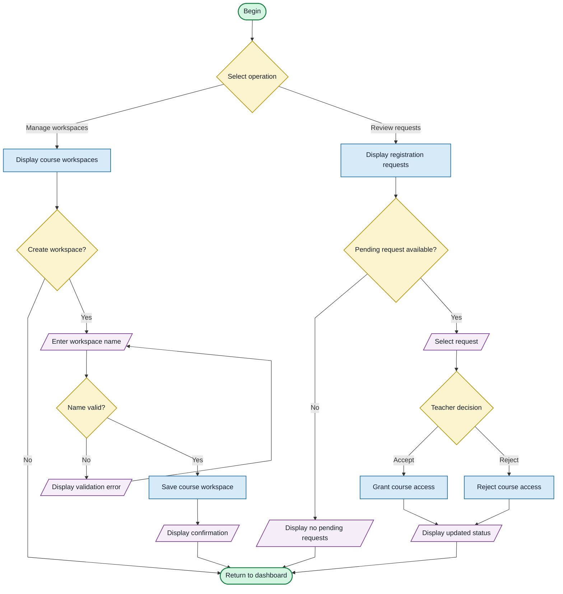
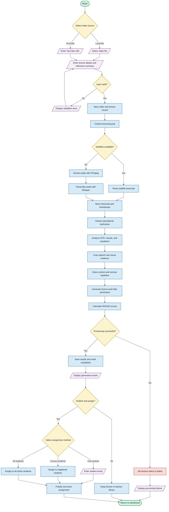
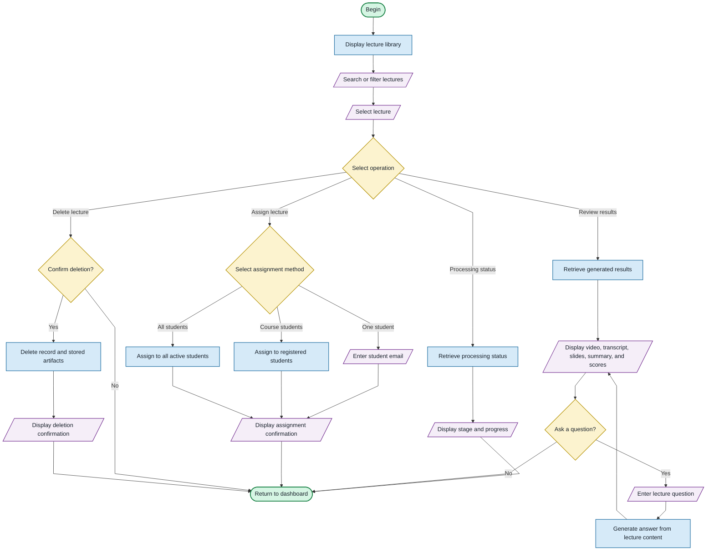

# ThinkNote AI — Teacher Flowcharts

The teacher module is divided into an overview and three detailed sub-processes.
This academic decomposition keeps each diagram readable and prevents crossing
flowlines.

## 1. Teacher Module Overview

## 2. Course and Student Management

## 3. Lecture Upload and AI Processing

## 4. Existing Lecture Management

## Symbol Key

- Oval: start, end, or return point.
- Rectangle: process or system operation.
- Diamond: decision or conditional branch.
- Parallelogram: user input or system output.
- Double-lined rectangle: referenced sub-process.
- Arrow: execution direction.
